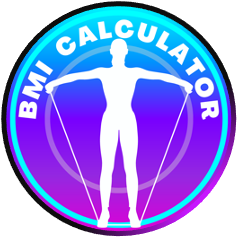
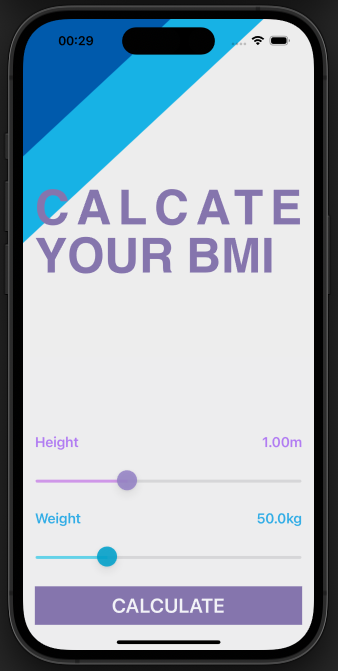
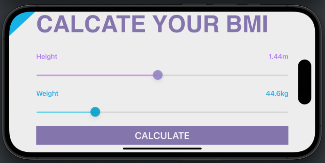
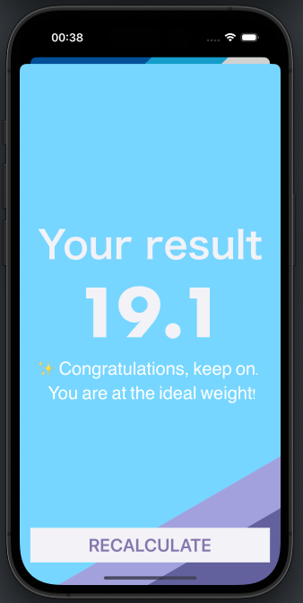
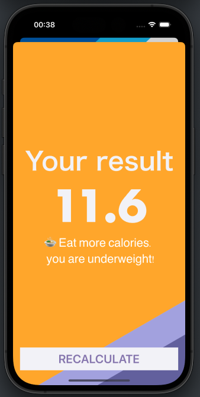
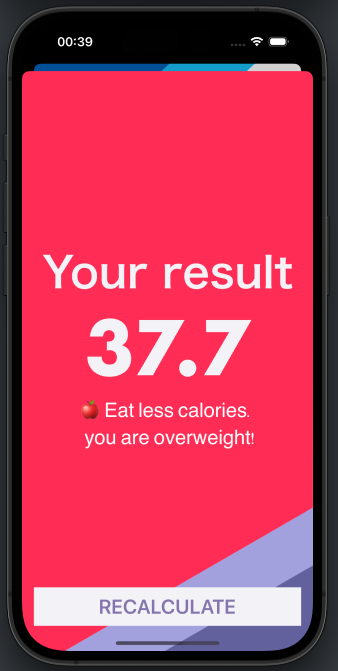
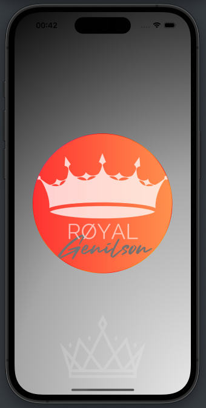

# BMi Calculator  

##  Goal

-    **Abstract**

   ```
   Calculate your BMI easily and receive feedback on how your result is and a little advice if you need it.
   ```
   
   

###    The purpose of this app is to implement the MVC design pattern and the concept of Swift Structures, navigation for multiscren apps, Custom ViewControllers Class.


##  Objetivo

```
Faça o calculo do seu IMC de forma fácil  e receba um feedback de como esta seu resultado e um pequeno conselho, caso precise.

```

### O objetivo deste app é implementar o padrão de design MVC e o conceito de Swift Structures, navegação entre telas/Views, Custom ViewControllers Class.















[](https://www.linkedin.com/in/genilson-do-carmo-8a42b89a/)     [](https://www.instagram.com/genilson_carmo/) 

