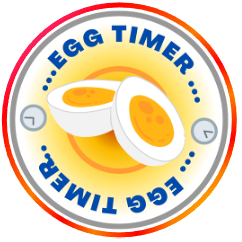
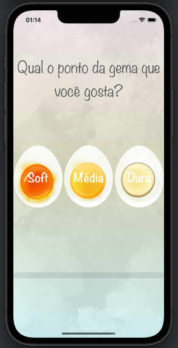
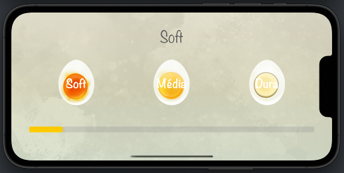
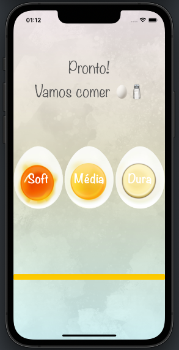
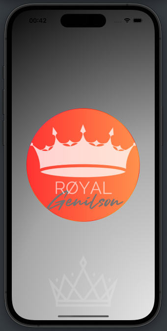

# Egg Timer  

##  Goal

-    **Abstract**

   ```
   Egg Timer - Timer for Boiling Eggs
   
   Egg Timer is ideal for better control during egg cooking.
   
   3 stages of egg cooking: soft, medium, or hard, using time in seconds.
   
   ```
   
   

###    The purpose of this app is to implement the MVC design pattern and the concept of Swift Structures.


## Objetivo 

```
 Egg Timer - Temporizado para Cozimento de Ovos

Egg Timer é ideal para melhor controle durante o cozimento do ovo.

3 estágios de cozimento dos ovos: mole(soft), médio cozimento(Média)  ou cozimento total(Dura), através do tempo em segundos.

```

### O objetivo deste app é implementar o padrão de design MVC e o conceito de Swift Structures.










[](https://www.linkedin.com/in/genilson-do-carmo-8a42b89a/)      [](https://www.instagram.com/genilson_carmo/) 

