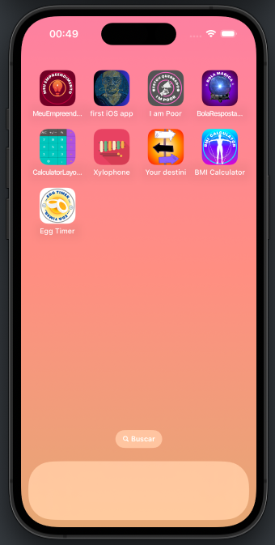

# 🧡 iOS Swifit  

       


###     🟠 MVC design pattern and the concept of Swift Structures. 

> Procuro uma oportunidade de **estágio**, **trainee** ou de **junior** para ingressar no ambiente de produção e ajudar no crescimento da equipe, da empresa e consequentemente o crescimento pessoal.
>
> Acredito que as experiencia que vivi na Toyota pode agregar no ambiente de desenvolvimento como por exemplo metodologias ágeis, padronização, kaizen de processo e pessoal, otimização de tempo e redução de custos e maximização de resultados. 
>
>
>  att,
>
> **♕** **Genilson do Carmo**

####  

```
  Venho desenvolvendo conhecimento em Desenvolvimento de Apps iOS aplicando:  UIKit, Swift, Objective-C, Desing pattern, Custom View Swift Structures, Orientação a Objetos, Clean Code e boas práticas de programação
```


 


[](https://www.linkedin.com/in/genilson-do-carmo-8a42b89a/)             [](https://www.instagram.com/genilson_carmo/) 
