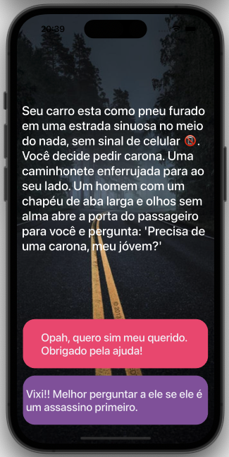

# Your Destini App

##  Goal

The goal of this challenge is  implementing the MVC design pattern and thinking about the state of the app and reviewing the concept of Swift Structures and using it to separate the Model from the Controller. 

[Linkedin](https://www.linkedin.com/in/genilson-do-carmo-8a42b89a//)
